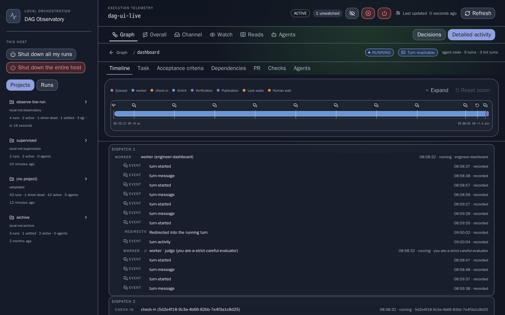
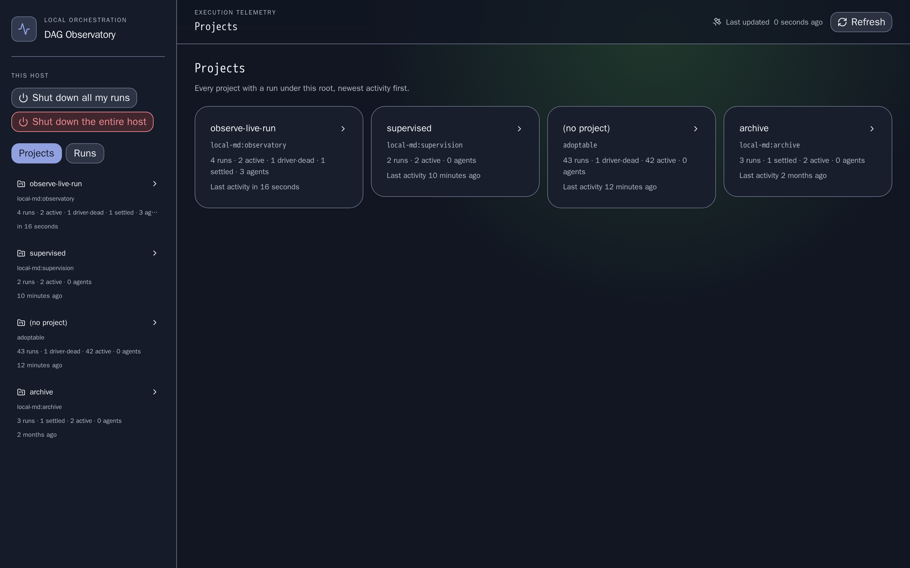
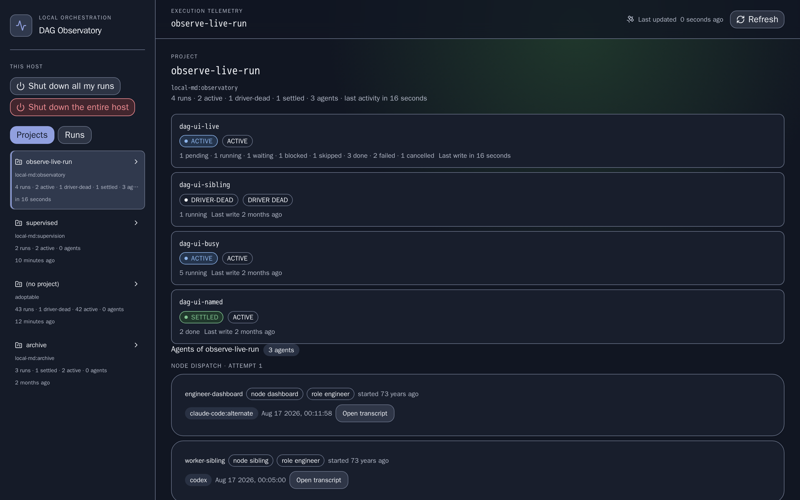
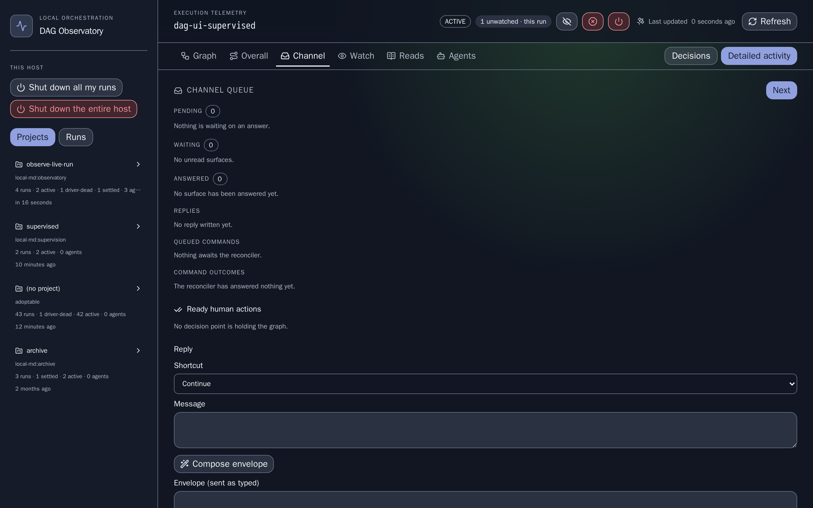
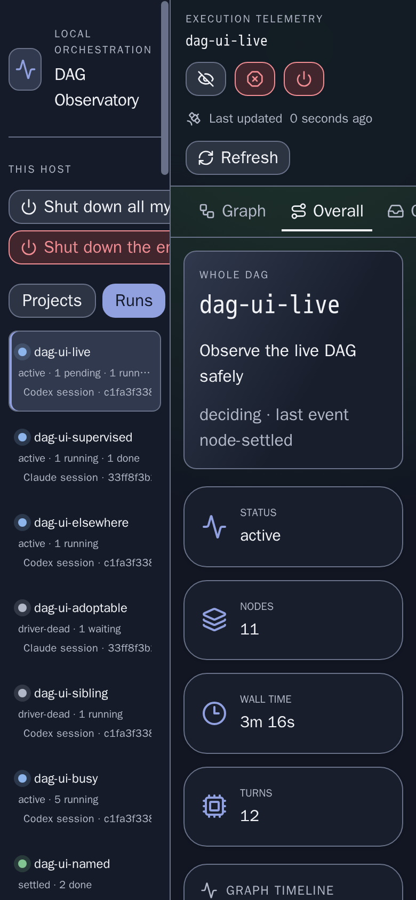

# onepipeline-ui


The read API and browser view for [onepipeline](https://github.com/nickderobertis/onepipeline)
runs: an axum server wrapping the onepipeline SDK, plus the frontend that reads it.

```bash
npm install -g onepipeline-api-cli               # or pip, or cargo — see Install
onepipeline-api serve --runs-root ./runs --ui    # the API, and the view above at /
```

## The DAG Observatory

[`apps/dag-ui`](docs/dag-ui.md) is that view: every run under a runs root, read as a
whole and then one level at a time. It opens on the **projects** — one card per plan,
newest activity first, each counting its runs in the server's own words — and a run
opened from one keeps that page a step back. The **Overall** view above is the run
read as a whole: its telemetry tiles over the graph timeline, which is the same plot,
the same lane words and the same clock used at three scopes — the whole run, one node,
one conversation — each a single click into the last.

It is not only a read. Every verb the `onepipeline` CLI has once a plan is running is
here, from the run it is about: stop, adopt, attest, reply on the channel, and shut
down a run, every run this session owns, or the whole host — each behind a confirm
that names what it will act on, and each showing the engine's own receipt or refusal
verbatim rather than a restatement of it. [`docs/dag-ui.md`](docs/dag-ui.md) is the
design record; what follows is what the screens are.

### The graph


Status and progress at a glance. Green nodes succeeded, red ones failed or were
cancelled, and an animated highlight marks the work still running. The canvas arrives
**fitted whole** — every card inside it — at every width the view is read at, and its
own controls zoom in from there; a floor on the fit rather than a fixed scale, because
the scale that fits a plan of six on a desktop shows a third of it on a phone with the
rest off both sides of a canvas that says nothing about having more beside it.
Selecting a node here, or from the keyboard-accessible node list beside it, opens that
node's timeline.

### A node: its timeline over its transcript



One node, read the way the run was. The plot at the top is the node's own work on the
node's own clock, collapsed to one line and expandable into a row per category; the
list underneath is what the node recorded, turn by turn. The two are one reading —
selecting in either moves the other — and the vocabulary does not change on the way
down, so a segment labelled `worker · judge` at the graph scope sits in the `worker`
lane here and heads the conversation opened from it with the same words.

### A conversation


The third scope. A transcript opens beside the timeline it came from, with that
session's own turns plotted above them and each turn's tokens and cost read underneath
it. A transcript is re-read only when the served timeline says *that* session recorded
something, so a run whose other nodes are busy costs an open conversation nothing; when
the session it belongs to is live, new turns are appended underneath the ones already
on the page rather than replacing them, and the panel follows that growth only while
the reader is at the end of it.

### Projects





A bare address is the project list, in the server's own order. The runs whose launch
recorded no project are a card like any other, headed by that word rather than by the
plan name of whichever run in them wrote last. A project's page is every DAG launched
against it, each row the same row the flat run list serves. Nothing here recomputes an
order or a count: the tallies are of the served rows, in the served words.

### The channel



The run's channel, shown as the engine keeps it: the pending surface nobody has given
up on, the waiting ones nobody has read, an abandoned one where the process serving it
exited without an answer, and the answered ones. Reading it consumes nothing. The
composer sends the editor's text **byte for byte** — never a parse of it — so a manager
can type an envelope this app has never heard of and the engine's refusal of a
malformed one is the engine's own.

### At the width it is actually read



The shell is exactly one viewport tall and every region inside it scrolls on its own,
which is a thing that fails silently — a region that overflows reports nothing, it just
puts content where no scroll can reach it. So the view is held to five widths down to a
phone, and a journey drives the ones whose outcome depends on width at both extremes.
The phone is where the two columns stop being a comfortable fit, which makes it the
width every reflow defect shows up at first.

Every screen above is a real capture of this app, driven by
[`just dag-ui-screens`](apps/dag-ui-e2e/AGENTS.md) against the real
`onepipeline-api serve --ui` over a generated run corpus, and gated on the content hash
of each image by [screencomp](https://github.com/nickderobertis/screencomp) — so a
picture here cannot quietly stop being true of the app.

## The read API

[`docs/contract.md`](docs/contract.md) is the source of truth, quoted verbatim
from the task that commissioned this repository. `tests/contract.rs` reconciles
the code against it, so a route that exists in one and not the other fails the
gate.

```
GET /healthz
GET /api/v2/runs                      # list w/ session attribution
GET /api/v2/runs/{run}                ?include_conversations=bool
GET /api/v2/runs/{run}/timeline       ?scope=run|node&node=ID
GET /api/v2/runs/{run}/conversations/{id}
GET /api/v2/runs/{run}/artifacts/{id}
GET /api/v2/events                    # SSE; fresh snapshot per connection
GET /api/v2/projects                  # runs grouped by project, as `onepipeline runs` groups them
GET /api/v2/projects/{project}
GET /api/v2/runs/{run}/channel        # the channel, consuming nothing
POST /api/v2/runs/{run}/channel/next  # claim the next surface
POST /api/v2/runs/{run}/channel/reply # the envelope's bytes, verbatim; ?correlation=C
POST /api/v2/runs/{run}/channel/surface
POST /api/v2/runs/{run}/attest
POST /api/v2/runs/{run}/stop          # as the session `--session` names
POST /api/v2/runs/{run}/adopt         # retains this binary as the driver
POST /api/v2/runs/{run}/shutdown      # `onepipeline shutdown RUN`; {grace?, force?}
POST /api/v2/shutdown                 # `--mine` or `--host`; {scope, grace?, force?}
GET /api/v2/runs/{run}/watch          # SSE over `onepipeline watch`
GET /api/v2/unwatched
GET /api/v2/host
GET /api/v2/runs/{run}/status
GET /api/v2/runs/{run}/results
GET /api/v2/goals
GET /api/v2/runs/{run}/goals
GET /api/v2/runs/{run}/transcript     ?node=ID
GET /api/v2/runs/{run}/telemetry
GET /api/v2/runs/{run}/agents         # every oneharness session the run launched
GET /api/v2/runs/{run}/nodes/{node}/agents
GET /api/v2/projects/{project}/agents # the union over the project's runs
```

The first seven are the read surface the browser view was written against;
the rest are every verb the `onepipeline` CLI has once a plan is running,
wrapped — each a thin call into `onepipeline::verbs`, never a re-implementation
and never the binary. Launching a plan and driving the planning stage are
outside this API; a reply on any run's channel is inside it. The server acts as
one launching session (`--session ID`, else `ONEPIPELINE_LAUNCHER_SESSION`),
which is what its stops, adoptions and shutdowns are judged by.

<!-- llmlint: ignore[contracts_have_one_source_or_a_drift_gate] the route index above and the version below are both read back against their source rather than left as second copies: `tests/contract.rs::the_readme_indexes_every_route_and_names_the_served_schema` holds every `METHOD path` line in this file to `routes::TABLE` in order, and asserts this file names "`telemetry_schema_version` ({TELEMETRY_SCHEMA_VERSION})" for the constant the envelope is served at. Deleting the `GET /api/v2/projects/{project}/agents` line fails it naming that route in the diff, which is how the agents routes reached this index at all. -->

Every successful response carries the schema-version preamble —
`api_version`, `telemetry_schema_version` (20), `observed_at` — with the payload
flattened alongside it. Every failure carries `{"error": {"code", "message"}}`.

Payloads themselves come from the onepipeline SDK. Anything presentation-worthy
lands there first, so the agent reading the CLI sees at least what the human in
the UI sees; this crate owns the envelope, not the records.

The view declares no schema, event name, or API path of its own —
`packages/dag-model` holds the contract's client half, `packages/telemetry-client`
is the only thing that speaks HTTP, and `packages/dag-layout` is the graph geometry.

## Install

Two deliverables, split by what they contain.

The read API, as the same prebuilt binary on three registries:

```bash
cargo install onepipeline-ui --locked  # from crates.io
pip install onepipeline-api-cli        # prebuilt wheel, no Rust toolchain
npm install -g onepipeline-api-cli     # prebuilt binary, no Rust toolchain
```

All three install one command, `onepipeline-api`:

```bash
onepipeline-api serve --runs-root ./runs        # the read API
onepipeline-api serve --runs-root ./runs --ui   # and the browser view, on the same address
```

`--ui` serves the DAG Observatory at `/` beside the API, with `/api/v2/…` and
`/healthz` unchanged and every path the bundle has no file for answered with
its `index.html`, so a deep link opens. The view is **built into the binary**
— the prebuilt wheels, npm packages and release archives all carry the bundle
of their own release — so a host that installed only the command needs no npm
package to open it. `cargo install` from crates.io compiles from source and
embeds the view only where `apps/dag-ui/dist` has been built beforehand; a
binary without one refuses `--ui` and says so. `--ui-dist DIR` serves a bundle
on disk instead, for developing the view against a real runs root.

The view is also published on its own, as a static bundle on npm:

```bash
npm install onepipeline-ui             # the built frontend under dist/
```

That package installs no command — it is `dist/`, to be served statically or
handed to `--ui-dist`. It is the same bundle `--ui` serves.

Prebuilt archives and their `.sha256` checksums are also attached to every
[GitHub Release](https://github.com/nickderobertis/onepipeline-ui/releases).

## Develop

```bash
just bootstrap        # from a clean clone; also activates the visual pre-push guard
just check            # the deterministic gate, every project
just gate             # `check` plus the llmlint LLM-judge tier — the pre-push bar
just dag-ui-screens   # re-photograph every screen above, in the pinned browser container
```

`just --list` is the full command surface. [`AGENTS.md`](AGENTS.md) is the
durable instruction layer for humans and agents working here, and
[`apps/dag-ui-e2e/AGENTS.md`](apps/dag-ui-e2e/AGENTS.md) is the note on the
screens: what they are, why the capture is byte-reproducible, and what to do when
the view legitimately changes.

## License

MIT. See [LICENSE](LICENSE).
